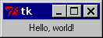

**[上一页](whats-tkinter.md)**    **下一页**

----------

## Hello, Tkinter ##

废话不多说，现在来看一些代码。

如你所知，每个教程都会从一个“hello world”类型示例开始。 在此概述中，我们也会向您展示这样的示例，而且展示两个。

首先，让我们看一个非常小的版本：

**我们的第一个Tkinter程序（文件：hello1.py）**

    from Tkinter import *
    
    root = Tk()
    
    w = Label(root, text="Hello, world!")
    w.pack()
    
    root.mainloop()

**运行这个示例**

要运行程序，像往常一样运行脚本：

    $ python hello1.py

将出现以下窗口。

要停止程序，只需关闭窗口。

**细节**

We start by importing the Tkinter module. It contains all classes, functions and other things needed to work with the Tk toolkit. In most cases, you can simply import everything from Tkinter into your module’s namespace:

from Tkinter import *
To initialize Tkinter, we have to create a Tk root widget. This is an ordinary window, with a title bar and other decoration provided by your window manager. You should only create one root widget for each program, and it must be created before any other widgets.

root = Tk()
Next, we create a Label widget as a child to the root window:

w = Label(root, text="Hello, world!")
w.pack()
A Label widget can display either text or an icon or other image. In this case, we use the text option to specify which text to display.

Next, we call the pack method on this widget. This tells it to size itself to fit the given text, and make itself visible. However, the window won’t appear until we’ve entered the Tkinter event loop:

root.mainloop()
The program will stay in the event loop until we close the window. The event loop doesn’t only handle events from the user (such as mouse clicks and key presses) or the windowing system (such as redraw events and window configuration messages), it also handle operations queued by Tkinter itself. Among these operations are geometry management (queued by the pack method) and display updates. This also means that the application window will not appear before you enter the main loop.