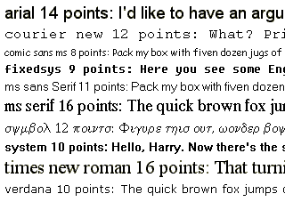
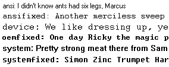
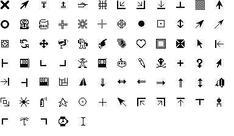

**[上一页](widget-configuration.md)**    **[下一页]( )**

----------

# 控件样式 #

所有Tkinter标准部件都提供了一组基本的“样式”选项，允许您修改每个部件的颜色、字体和其他视觉特性。

All Tkinter standard widgets provide a basic set of “styling” options, which allow you to modify things like colors, fonts, and other visual aspects of each widget.

## Colors ##
Most widgets allow you to specify the widget and text colors, using the background and foreground options. To specify a color, you can either use a color name, or explicitly specify the red, green, and blue (RGB) color components.

### Color Names ###
Tkinter includes a color database which maps color names to the corresponding RGB values. This database includes common names like Red, Green, Blue, Yellow, and LightBlue, but also more exotic things like Moccasin, PeachPuff, etc.

On an X window system, the color names are defined by the X server. You might be able to locate a file named xrgb.txt which contains a list of color names and the corresponding RGB values. On Windows and Macintosh systems, the color name table is built into Tk.

Under Windows, you can also use the Windows system colors (these can be changed by the user via the control panel):

SystemActiveBorder,  
 SystemActiveCaption, SystemAppWorkspace, SystemBackground, SystemButtonFace, SystemButtonHighlight, SystemButtonShadow, SystemButtonText, SystemCaptionText, SystemDisabledText, SystemHighlight, SystemHighlightText, SystemInactiveBorder, SystemInactiveCaption, SystemInactiveCaptionText, SystemMenu, SystemMenuText, SystemScrollbar, SystemWindow, SystemWindowFrame, SystemWindowText.

On the Macintosh, the following system colors are available:

SystemButtonFace, SystemButtonFrame, SystemButtonText, SystemHighlight, SystemHighlightText, SystemMenu, SystemMenuActive, SystemMenuActiveText, SystemMenuDisabled, SystemMenuText, SystemWindowBody.

Color names are case insensitive. Many (but not all) color names are also available with or without spaces between the words. For example, “lightblue”, “light blue”, and “Light Blue” all specify the same color.

### RGB Specifications ###
If you need to explicitly specify a color, you can use a string with the following format:

#RRGGBB
RR, GG, BB are hexadecimal representations of the red, green and blue values, respectively. The following sample shows how you can convert a color 3-tuple to a Tk color specification:

tk_rgb = "#%02x%02x%02x" % (128, 192, 200)
Tk also supports the forms “#RGB” and “#RRRRGGGGBBBB” to specify each value with 16 and 65536 levels, respectively.

You can use the winfo_rgb widget method to translate a color string (either a name or an RGB specification) to a 3-tuple:

rgb = widget.winfo_rgb("red")
red, green, blue = rgb[0]/256, rgb[1]/256, rgb[2]/256
Note that winfo_rgb returns 16-bit RGB values, ranging from 0 to 65535. To map them into the more common 0-255 range, you must divide each value by 256 (or shift them 8 bits to the right).

## Fonts ##
Widgets that allow you to display text in one way or another also allows you to specify which font to use. All widgets provide reasonable default values, and you seldom have to specify the font for simpler elements like labels and buttons.

Fonts are usually specifed using the font widget option. Tkinter supports a number of different font descriptor types:

### Font descriptors ###

User-defined font names

System fonts

X font descriptors

With Tk versions before 8.0, only X font descriptors are supported (see below).

Font descriptors #
Starting with Tk 8.0, Tkinter supports platform independent font descriptors. You can specify a font as tuple containing a family name, a height in points, and optionally a string with one or more styles. Examples:

("Times", 10, "bold")
("Helvetica", 10, "bold italic")
("Symbol", 8)
To get the default size and style, you can give the font name as a single string. If the family name doesn’t include spaces, you can also add size and styles to the string itself:

"Times 10 bold"
"Helvetica 10 bold italic"
"Symbol 8"
Here are some families available on most Windows platforms:

Arial (corresponds to Helvetica), Courier New (Courier), Comic Sans MS, Fixedsys, MS Sans Serif, MS Serif, Symbol, System, Times New Roman (Times), and Verdana:

Note that if the family name contains spaces, you must use the tuple syntax described above.

The available styles are normal, bold, roman, italic, underline, and overstrike.

Tk 8.0 automatically maps Courier, Helvetica, and Times to their corresponding native family names on all platforms. In addition, a font specification can never fail under Tk 8.0; if Tk cannot come up with an exact match, it tries to find a similar font. If that fails, Tk falls back to a platform-specific default font. Tk’s idea of what is “similar enough” probably doesn’t correspond to your own view, so you shouldn’t rely too much on this feature.

Tk 4.2 under Windows supports this kind of font descriptors as well. There are several restrictions, including that the family name must exist on the platform, and not all the above style names exist (or rather, some of them have different names).

### Font names ###
In addition, Tk 8.0 allows you to create named fonts and use their names when specifying fonts to the widgets.

The tkFont module provides a Font class which allows you to create font instances. You can use such an instance everywhere Tkinter accepts a font specifier. You can also use a font instance to get font metrics, including the size occupied by a given string written in that font.

 
tkFont.Font(family="Times", size=10, weight=tkFont.BOLD)
tkFont.Font(family="Helvetica", size=10, weight=tkFont.BOLD,
            slant=tkFont.ITALIC)
tkFont.Font(family="Symbol", size=8)
If you modify a named font (using the config method), the changes are automatically propagated to all widgets using the font.

The Font constructor supports the following style options (note that the constants are defined in the tkFont module):

family
Font family.

size
Font size in points. To give the size in pixels, use a negative value.

weight
Font thickness. Use one of NORMAL or BOLD. Default is NORMAL.

slant
Font slant. Use one of NORMAL or ITALIC. Default is NORMAL.

underline
Font underlining. If 1 (true), the font is underlined. Default is 0 (false).

overstrike
Font strikeout. If 1 (true), a line is drawn over text written with this font. Default is 0 (false).

### System fonts ###
Tk also supports system specific font names. Under X, these are usually font aliases like fixed, 6x10, etc.

Under Windows, these include ansi, ansifixed, device, oemfixed, system, and systemfixed:

On the Macintosh, the system font names are application and system.

Note that the system fonts are full font names, not family names, and they cannot be combined with size or style attributes. For portability reasons, avoid using these names wherever possible.

### X Font Descriptors ###
X Font Descriptors are strings having the following format (the asterisks represent fields that are usually not relevant. For details, see the Tk documentation, or an X manual):

-*-family-weight-slant-*--*-size-*-*-*-*-charset
The font family is typically something like Times, Helvetica, Courier or Symbol.

The weight is either Bold or Normal. Slant is either R for “roman” (normal), I for italic, or O for oblique (in practice, this is just another word for italic).

Size is the height of the font in decipoints (that is, points multiplied by 10). There are usually 72 points per inch, but some low-resolution displays may use larger “logical” points to make sure that small fonts are still legible. The character set, finally, is usually ISO8859-1 (ISO Latin 1), but may have other values for some fonts.

The following descriptor requests a 12-point boldface Times font, using the ISO Latin 1 character set:

-*-Times-Bold-R-*--*-120-*-*-*-*-ISO8859-1
If you don’t care about the character set, or use a font like Symbol which has a special character set, you can use a single asterisk as the last component:

-*-Symbol-*-*-*--*-80-*
A typical X server supports at least Times, Helvetica, Courier, and a few more fonts, in sizes like 8, 10, 12, 14, 18, and 24 points, and in normal, bold, and italic (Times) or oblique (Helvetica, Courier) variants. Most servers also support freely scaleable fonts. You can use programs like xlsfonts and xfontsel to check which fonts you have access to on a given server.

This kind of font descriptors can also be used on Windows and Macintosh. Note that if you use Tk 4.2, you should keep in mind that the font family must be one supported by Windows (see above).

## Text Formatting ##
While text labels and buttons usually contain a single line of text, Tkinter also supports multiple lines. To split the text across lines, simply insert newline characters (\n) where necessary.

By default, the lines are centered. You can change this by setting the justify option to LEFT or RIGHT. The default value is CENTER.

You can also use the wraplength option to set a maximum width, and let the widget wrap the text over multiple lines all by itself. Tkinter attempts to wrap on whitespace, but if the widget is too narrow, it may break individual words across lines.

## Borders ##
All Tkinter widgets have a border (though it’s not visible by default for some widgets). The border consists of an optional 3D relief, and a focus highlight region.

### Relief ###
The relief settings control how to draw the widget border:

borderwidth (or bd)
This is the width of the border, in pixels. Most widgets have a default borderwidth of one or two pixels. There’s hardly any reason to make the border wider than that.

relief
This option controls how to draw the 3D border. It can be set to one of SUNKEN, RAISED, GROOVE, RIDGE, and FLAT.

### Focus Highlights ###
The highlight settings control how to indicate that the widget (or one of its children) has keyboard focus. In most cases, the highlight region is a border outside the relief. The following options control how this extra border is drawn:

highlightcolor
This option is used to draw the highlight region when the widget has keyboard focus. It’s usually black, or some other distinct contrast color.

highlightbackground
This option is used to draw the highlight region when the widget doesn’t have focus. It’s usually same as the widget background.

highlightthickness
This option is the width of the highlight region, in pixels. It is usually one or two pixels for widgets that can take keyboard focus.

## Cursors ##
cursor
This option controls which mouse cursor to use when the mouse is moved over the widget.

If this option isn’t set, the widget uses the same mouse pointer as its parent.

Note that some widgets, including the Text and Entry widgets, set this option by default.

----------

**[上一页](widget-configuration.md)**    **[下一页]( )**
